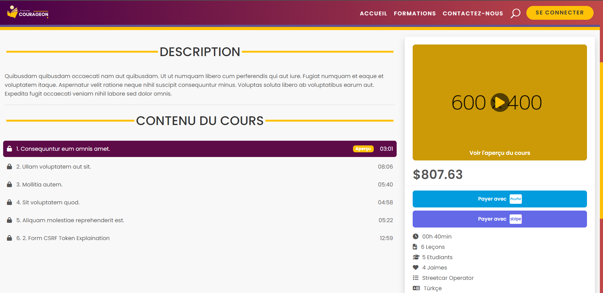

  

## About Courageon
Welcome to the COURAGEON Platform repository! This platform is designed to provide a robust and intuitive learning 
environment for educators and learners. It offers a range of features to enhance the learning experience, 
including seamless media storage, integrated payment options and more.

## Requirements

-   PHP >= 8.1 (or higher)
-   Composer
-   Apache
-   MySQL

## :warning: Important :warning: 
1. Open your terminal in root project folder and run `composer install` to install all dependencies.  
2. Create those folders: `public/images/formations`, `public/images/categories`, `public/images/videos`, `public/files/formations`.
3. Install FFmpeg (used for extracting thumbnail from the video): [Guide to Install FFmpeg](https://phoenixnap.com/kb/ffmpeg-windows).
4. Import the database schema placed in the root `database_schema.sql`.
5. Run the controller faker to populate the database with fake data `http://localhost/courageon/faker`.
6. Make copy of `.env.exemple` and rename it to `.env`, set your SMTP configuration, set Third-party applications in order to login users with social media accounts and link your payment gateway accounts (Paypal & Stripe).

## Screenshots

